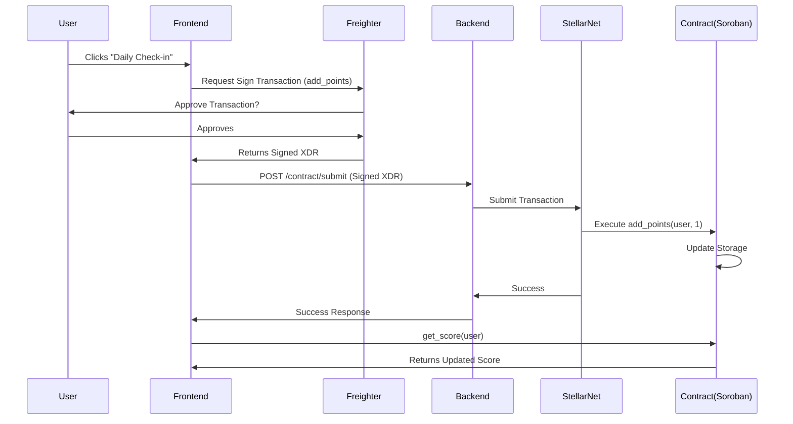

# User Reputation System

A full-stack web application integrated with the Stellar blockchain to track and verify user reputation scores. This project demonstrates a hybrid Web2/Web3 architecture, bridging traditional database storage with on-chain Soroban smart contracts.

## 🚀 Project Overview

The **User Reputation System** allows users to:
- Register and authenticate via a web interface.
- Perform daily tasks to earn reputation points.
- Connect their **Freighter Wallet** to link their Stellar identity.
- Submit reputation updates directly to the **Stellar Testnet** via a **Soroban Smart Contract**.

**Primary Goal**: To build a verifiable, on-chain reputation history where users own their data.

## 🛠 Tech Stack

### Frontend
- **Framework**: [Next.js](https://nextjs.org/) (App Router, TypeScript)
- **Styling**: Vanilla CSS Modules (Clean, dependency-free)
- **Blockchain Interaction**: `@stellar/stellar-sdk`, `@stellar/freighter-api`

### Backend
- **Runtime**: Node.js
- **Framework**: Express.js (TypeScript)
- **Database**: SQLite (via Prisma ORM) - *Easily switchable to PostgreSQL*
- **Auth**: JWT (JSON Web Tokens)
- **Role**: Relays signed transactions to Stellar Network (Non-custodial)

### Blockchain & Smart Contract
- **Network**: Stellar Testnet
- **Smart Contract Engine**: Soroban (Rust)
- **Wallet**: Freighter (Non-custodial browser extension)

## 🏗 Architecture & Flow

The system uses a **Hybrid Architecture**:

1.  **Identity Management**: Users register via email/password (stored in SQLite).
2.  **Wallet Binding**: Users sign a message/transaction with **Freighter**, linking their Public Stellar Address to their profile in the database.
3.  **Reputation Logic**:
    - **Off-Chain**: Immediate feedback in the UI and database record.
    - **On-Chain**: Users invoke the `add_points` function on the Soroban contract. The transaction is signed in the browser (Freighter) and relayed by the Backend API to the Stellar Network.
4.  **Verification**: The Frontend queries the Smart Contract directly to display the "True" On-Chain Score.



## 🚀 Quick Start (Mock Mode)
*No Blockchain tools required! Perfect for testing the UI and Database.*

1.  **Backend**:
    ```bash
    cd server
    npm install
    npx prisma generate
    npx prisma db push
    npm run dev
    ```
2.  **Frontend**:
    ```bash
    cd client
    npm install
    npm run dev
    ```
3.  **Open** `http://localhost:3000`.
    *   *Note: If you haven't deployed the contract, the app automatically switches to "Mock Mode", simulating transactions so you can test the full flow.*

## ⚙️ Full Setup (With Blockchain)

### Prerequisites
- Node.js (v18+)
- [Soroban CLI](https://soroban.stellar.org/docs/getting-started/setup) & Rust (Only for Contract Deployment)
- [Freighter Wallet Extension](https://www.freighter.app/)

### 1. Smart Contract Deployment
*Skip this if you just want to test the Web2 features.*

1.  Navigate to `contracts/reputation`.
2.  Build & Deploy:
    ```bash
    soroban contract build
    soroban contract deploy --wasm target/wasm32-unknown-unknown/release/reputation_contract.wasm --source alice --network testnet
    ```
3.  **Copy the Contract ID** (starts with `C...`).
4.  Create `client/.env.local`:
    ```bash
    NEXT_PUBLIC_CONTRACT_ID=C...
    ```

### 2. Backend Setup
1.  `cd server`
2.  `npm install`
3.  `npx prisma generate` (Fixes DB client issues)
4.  `npx prisma db push` (Syncs DB schema)
5.  `npm run dev`

### 3. Frontend Setup
1.  `cd client`
2.  `npm install`
3.  `npm run dev`

## 🔧 Troubleshooting

### "500 Internal Server Error" on Wallet Connect
- **Cause**: Database client out of sync.
- **Fix**: Run `npx prisma generate` in the `server` folder and restart.

### "Contract ID not set"
- **Cause**: You haven't deployed the contract.
- **Fix**: The app should auto-switch to Mock Mode. If not, check the console logs.

## 📖 Usage Guide

### 1. Registration
- Open `http://localhost:3000`.
- Click **Register** to create a new account.
- Log in to access the Dashboard.

### 2. Connect Wallet
- In the Dashboard, locate the "Stellar Wallet" card.
- Click **Connect Freighter Wallet**.
- Approve the connection in the pop-up.
- **Note**: Ensure your Freighter is set to **Testnet** and funded (use [Stellar Friendbot](https://laboratory.stellar.org/#account-creator?network=test)).

### 3. Earn Reputation
- Click **Daily Check-in** (+1 Point) or **Complete Task** (+5 Points).
- If Wallet is connected:
    - Freighter will prompt you to sign the transaction.
    - Confirm the transaction.
    - Wait a few seconds for network confirmation.
    - The **On-Chain Score** will update automatically.

## 📜 Smart Contract Details

The Soroban contract is a simple state storage contract.

- **Storage**: Persistent storage of `Address -> u32`.
- **Functions**:
    - `add_points(env, user: Address, amount: u32)`: Adds points to the caller's score. Requires user signature/auth.
    - `get_score(env, user: Address) -> u32`: Returns the current score.

## 📂 Project Structure

```
├── client/                 # Next.js Frontend
│   ├── app/                # Pages & Layouts
│   ├── services/           # API & Soroban integration utils
│   └── styles/             # Global styles
├── server/                 # Express Backend
│   ├── src/
│   │   ├── controllers/    # Request handlers (Auth, User, Wallet, Contract)
│   │   ├── routes/         # API Route definitions
│   │   └── services/       # Business logic abstraction
│   └── prisma/             # Database schema
└── contracts/              # Soroban Smart Contracts
    └── reputation/         # Rust source code
        └── src/            # Contract logic (lib.rs)
```

## 🔒 Security & Best Practices
- **Non-Custodial**: Private keys never touch the backend.
- **Separation of Concerns**: Frontend handles signing; Backend handles relaying.
- **Environment config**: Sensitive IDs are kept in `.env` files (not committed).

---
*Built for the Rise In Project.*
